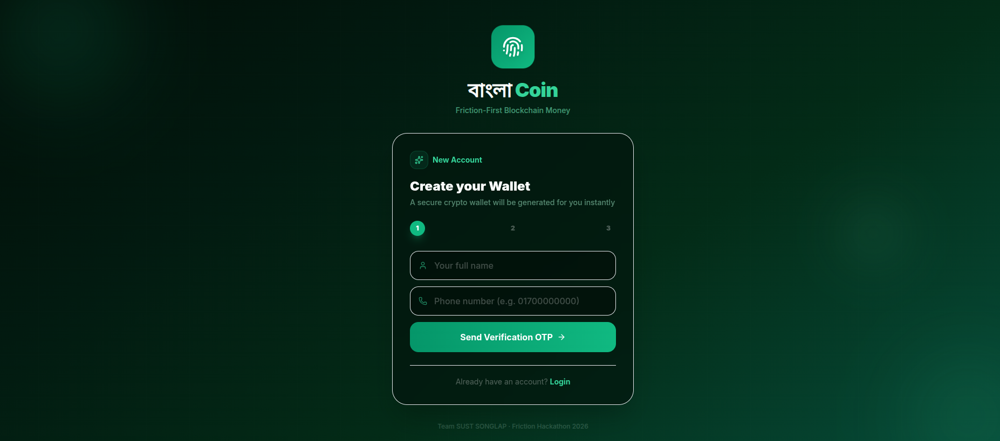
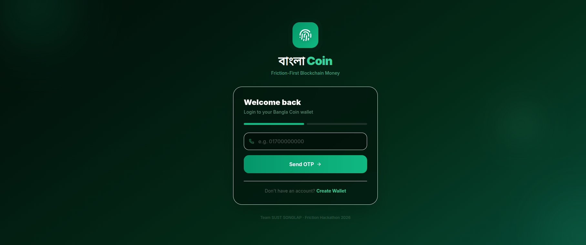
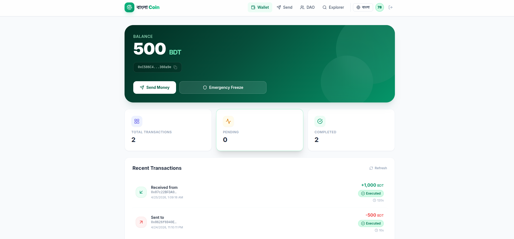
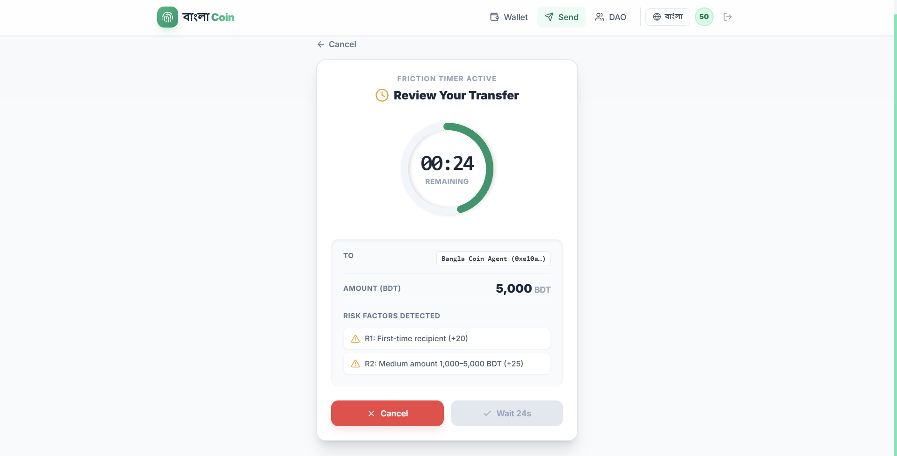
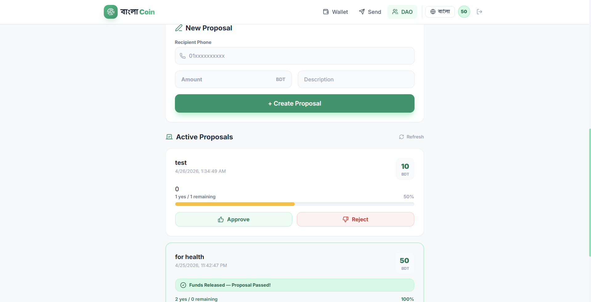
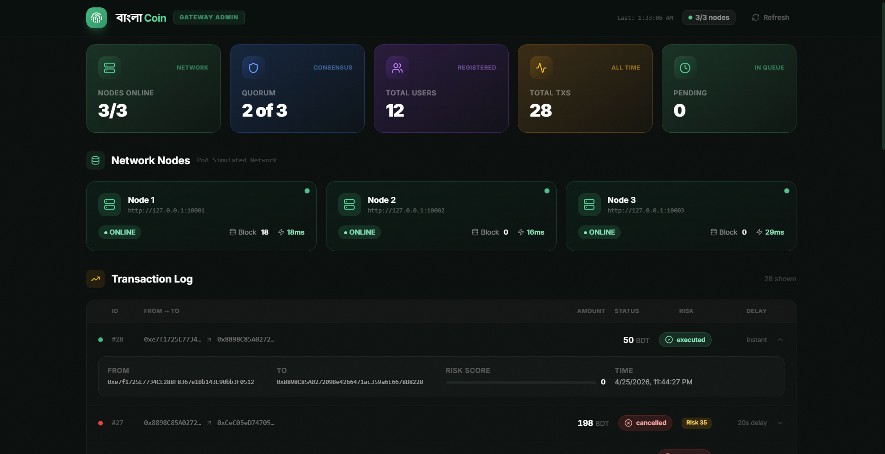
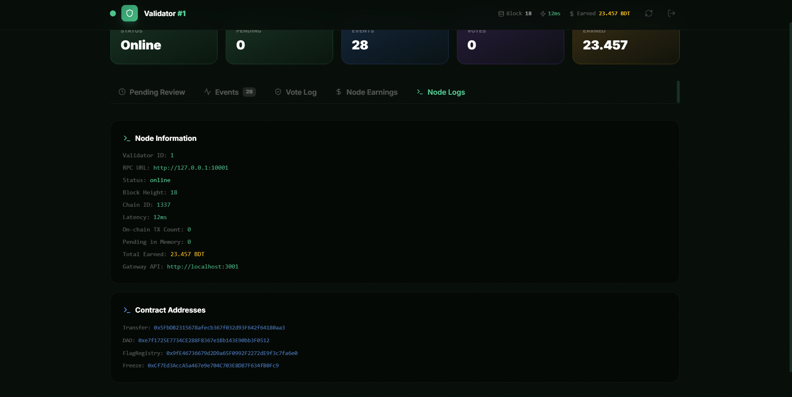
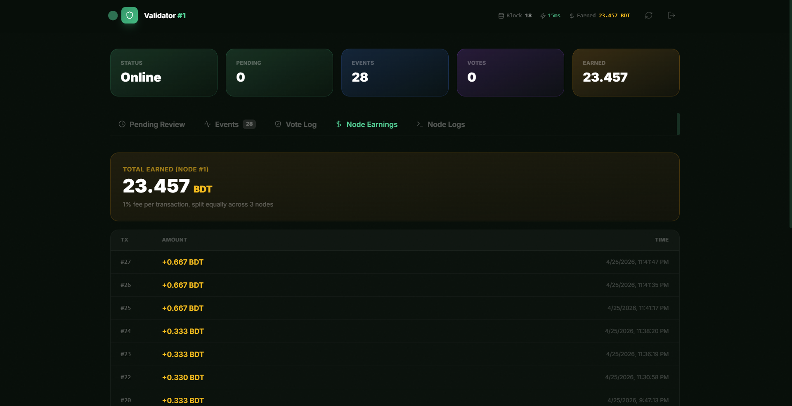
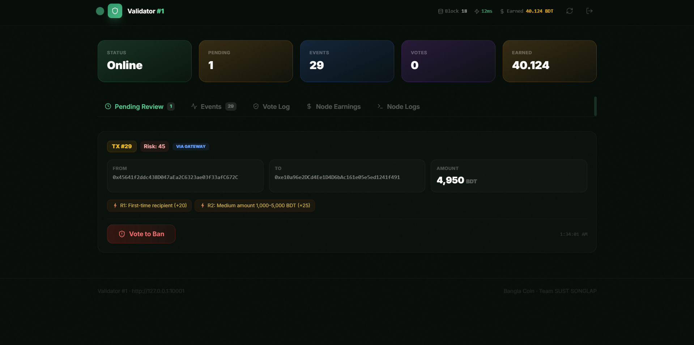
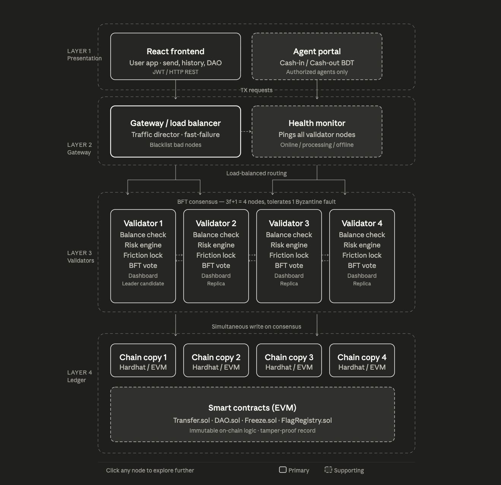

# User App Demo: [bangla-coin-sust.vercel.app](https://bangla-coin-sust.vercel.app) <br/>
*There was a slight mistake while filling out the submission form for Friction Hackathon.
Instead of `bangla-coin-sust.vercel.app` , we mistakenly wrote `bangla_coin_sust.vercel.app`
Please visit the correct link. We apologize for this mistake.*

#### Default Credentials
`010000000001`, `010000000002` are agent accounts. Any other account with any phone number is regular user account. The default OTP is `123456`.

**Video Presentation and Project Document**: https://drive.google.com/drive/folders/1qRZsYYU4KDS6i1sEx78BtwdCKXHmdW8M

# 1. Bangla Coin — Friction-First Blockchain Money 🇧🇩

Bangla Coin is an innovative, **Friction-First** Web3 platform designed to combat scams and fraud through dynamic transaction delays. Unlike traditional blockchains where transactions are instant and irreversible, Bangla Coin introduces a smart "Friction Engine" that slows down high-risk transfers, giving users a window to cancel suspicious transactions before they are finalized on the blockchain.


### Bangla Coin: Securing the Future of Bangladeshi Digital Finance
In the rapidly evolving digital landscape of Bangladesh, speed has often been the primary metric for financial success. However, the rise of "instant" mobile financial services has inadvertently fueled a parallel surge in digital fraud, social engineering scams, and accidental transfers. Bangla Coin, developed by Team SUST SONGLAP, introduces a paradigm shift: Friction-First Finance. By prioritizing security over velocity, Bangla Coin provides a robust, blockchain-backed solution designed to protect every Taka.

### Strategic Usage: Intentional Friction
The core usage of Bangla Coin revolves around its Dynamic Risk Engine. Unlike traditional apps that process payments in milliseconds, Bangla Coin evaluates every transaction against six specific risk rules.

For a daily user, the experience is intuitive yet protective. When sending money to a verified family member, the "friction" is minimal—perhaps a 10-second countdown. However, if a user attempts to send a large sum to a first-time recipient or a wallet flagged by the community, the system automatically escalates the delay to the 180-second maximum. This critical "cool-down" period allows users to catch mistakes or realize they are being scammed before the funds are permanently committed to the blockchain.

Agents play a vital role in the ecosystem, serving as the bridge between physical cash and digital Bangla Coins. Using the Agent Cash-In feature, users can convert BDT into digital assets securely.

Furthermore, the Community Wallet (DAO) functionality allows groups—such as student organizations or small businesses—to manage collective funds. Usage here is democratic: a member proposes a spend, and the funds only release once a majority of the group votes "Yes" on-chain.

### Transformative Benefits: Safety and Empowerment
The primary benefit of Bangla Coin is the mitigation of financial loss. By making "slow money" a feature, the platform effectively kills the "urgency" tactic used by scammers.

 - **Fraud Deterrence via "Vote to Ban"**: The decentralized network of Validator Nodes acts as a digital jury. If a transaction appears fraudulent, validators can vote to ban it, preventing the movement of stolen funds. This collective oversight provides a layer of security that centralized systems often struggle to replicate in real-time.

 - **Immutable Transparency**: Every transaction is recorded on a SHA-256 hash-linked ledger. For the user, this means an indisputable, permanent record of their financial history that cannot be altered or deleted by any central authority.

 - **Empowerment through DAOs**: For rural communities and small cooperatives in Bangladesh, the DAO feature eliminates the "trusted middleman" problem. It ensures that no single individual can vanish with group savings, as the smart contract enforces collective permission for every withdrawal.

 - **Resilience and Reward**: By running on a Permissioned Proof-of-Authority (PoA) chain, the system remains energy-efficient and fast enough for high-volume use while rewarding the distributed validators who provide the computational power to keep the network alive.

In summary, Bangla Coin is not just a payment tool; it is a safety net. It empowers the citizens of Bangladesh to embrace blockchain technology with the confidence that their hard-earned money is protected by the very code that moves it.


### Project at a Glance
| Attribute | Detail |
| :--- | :--- |
| **Project Name** | Bangla Coin |
| **Hackathon** | Friction Hackathon 2026 |
| **Team** | SUST SONGLAP |
| **License** | MIT (Fully Open Source) |
| **Chain Type** | Permissioned PoA (Hardhat local → Polygon Mumbai testnet) |
| **Peg** | 1 Bangla Coin = 1 BDT (Fully collateralized) |
| **Max Delay** | 3 minutes (180 seconds, enforced on-chain) |
| **MVP Scope** | 48-hour hackathon build |


## 📸 Screenshots

### User Onboarding
| Signup Page | Login Page |
| :---: | :---: |
|  |  |


### Core Application Interface
### User Dashboard
The central hub for managing BDT balances and viewing transaction history.


### The Friction Engine in Action
A live visualization of the on-chain delay enforced by the risk engine.



### Community Wallet (DAO)
These screens demonstrate the decentralized governance of group funds.
| Wallet Overview | Proposal Approval |
| :---: | :---: |
|  |  |


### API Gateway Management


### Validator Node Metrics
| Node Status | Node Admin |
| :---: | :---: |
|  |  |

### Validator Node Voting for Transaction Ban


### System Architecture


---

## 2. MVP Feature Shortlist
The 48-hour build focuses on eight core features. All other functionality is deferred to Phase 2+.

### 2.1 Built (In-Scope)
* **F1 — Wallet & Balance:** Phone-based login (OTP), custodial encrypted keys, BDT balance display, and transaction history.
* **F2 — Transactions with Friction Timer:** A risk engine scores transactions, returning a delay of 10s – 3m. A live countdown is displayed before execution.
* **F3 — Vote to Ban (Validators):** If a majority of validator nodes flag a transaction as suspicious, it is rejected before finality.
* **F4 — Community Wallet (DAO):** Group wallets where funds release only after a majority approval vote on-chain.
* **F5 — Emergency Freeze:** A "one-tap" lock button that cancels all pending transactions. Requires a PIN to unfreeze.
* **F6 — Immutable Transaction Log:** A SHA-256 hash-linked ledger with a basic block explorer to verify the chain of hashes.
* **F7 — Agent Network:** Authorized agents can perform "Cash-In" for users and maintain cash equilibrium via the agent network.
* **F8 — Validator Rewards:** Distributed servers (Validator Nodes) earn a tiny fee for computational power used to secure the network.

### 2.2 Deferred (Phase 2+)
* Agent cash-out portal (Requires real-world BDT flow integration).
* USSD / SMS interface for feature phones.
* Social key recovery / Shamir’s Secret Sharing.
* Interoperability with bKash, Nagad, and traditional banks.

---

## 3. System Architecture
The system utilizes a four-layer stack where the blockchain serves as the single source of truth.


* **Layer 1 — User App:** (React + Vite + Tailwind) Handles JWT/HTTP requests for users (sending/DAO) and agents (cash-in).
* **Layer 2 — API Gateway:** (Node.js) Traffic director with fast-failure logic. Includes a Health Monitor to blacklist unresponsive validator nodes.
* **Layer 3 — Validators:** (Node.js + BFT Consensus) Independent servers running balance checks, transaction banning votes, and the Friction Lock.
* **Layer 4 — Chain / Ledger:** (Hardhat / Polygon Edge) Four simultaneous chain copies for redundancy. Hosts `Transfer.sol`, `DAO.sol`, `Freeze.sol`, and `FlagRegistry.sol`.

---

## 4. Risk Engine — Logic & Rules
The risk engine operates off-chain (Node.js), generating a risk score that dictates the on-chain friction delay.

| Rule | Trigger | Risk Points | Action |
| :--- | :--- | :--- | :--- |
| **R1** | First-time recipient | +20 pts | 10 sec friction timer |
| **R2** | Amount 1,000–5,000 BDT | +25 pts | 30 sec delay + SMS confirm |
| **R3** | Amount > 5,000 BDT | +40 pts | 1 min delay + warning modal |
| **R4** | Recipient flagged by 3+ users | +45 pts | 2 min delay + red warning |
| **R5** | 5+ transfers in 1 hour | +35 pts | 1 min delay + freeze prompt |
| **R6** | **Total Score > 70** | **Escalate** | 3 min lock + dual confirm (Hard Cap) |


## DIRECTORY STRUCTURE TO BUILD
```
bangla-coin/
├── bangla-chain/          # Automation scripts to download and run Polygon Edge nodes
├── contracts/             # Hardhat project (Solidity contracts + deploy scripts)
├── api-gateway/           # Port 5000: Central Express API (Risk Engine + FallbackProvider)
├── gateway-admin/         # Port 6000: React UI monitoring the Gateway
├── validator-template/    # Base code for Validator node backend/UI (to be duplicated later)
│   ├── backend/           # Express server listening to EVM events + Voting
│   └── frontend/          # React dashboard for approving/rejecting bans
└── user-app/              # Port 3000: React Web App for end-users
```


## 🚀 Quick Start Guide

Run these commands first to install Node.js packages:

`npm install`

`cd user-app && npm install`

`cd api-gateway && npm install`

`cd gateway-admin && npm install`

`cd validator-template/frontend && npm install`

`cd validator-template/backend && npm install`

## Ports
* 10001, 10002, 10003 -> Hardhat RPC Nodes (Managed via bash scripts you will write).
* 5000 -> Main API Gateway (Node.js)
* 6000 -> Main API Gateway Admin UI (React)
* 3001, 3002, 3003 -> Validator Backends 1, 2, and 3 (Node.js)
* 4001, 4002, 4003 -> Validator Admin UIs 1, 2, and 3 (React)
* 3000 -> Bangla Coin User App (React)

### on Windows

```
.\start-all.ps1
```

### on Linux

```
sudo chmod +x ./start-all.sh && ./start-all.sh
```

### Default Credentials 

 - `user-app`: `010000000001`, `010000000002` are agent accounts. Any other account with any phone number is regular user account. The default OTP is `123456`.
 - `Validator Node Admin Panel`: The handle is `admin` and password is `admin`.

---
*Built for the Friction Hackathon 2026 by Team SUST SONGLAP*
